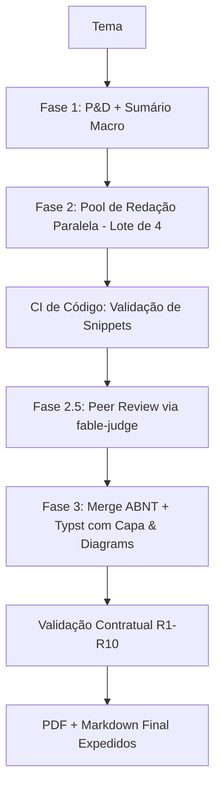

# Relatório Técnico: Processo Completo do Comando `criar-livro` e Oportunidades de Upgrade

> **Projeto:** Fábrica Agêntica de Livros  
> **Arquivo:** `fabrica-agentica-de-livros.md`  
> **Data:** Agosto 2026  
> **Status:** Documentação de Arquitetura & Plano de Melhorias  

---

## 1. Visão Geral da Esteira Editorial Agêntica

O comando `/criar-livro <tema>` é o ponto de entrada principal da **Fábrica Agêntica de Livros** (definido em [.claude/commands/criar-livro.md](file:///c:/Users/trcnologia/Desktop/proj_livros/fabrica-de-livros/.claude/commands/criar-livro.md) e detalhado em [docs/fluxo-fabrica-de-livros.md](file:///c:/Users/trcnologia/Desktop/proj_livros/fabrica-de-livros/docs/fluxo-fabrica-de-livros.md)).

Sua finalidade é transformar uma única instrução humana (o tema da obra) em um livro técnico completo de literatura técnica, formatado conforme as normas ABNT, com no mínimo **16 capítulos**, mais de **70 páginas (~175.000 caracteres)**, código explicativo, referências bibliográficas e exportação final autônoma em formato **PDF via Pandoc + Typst**.

---

## 2. Detalhamento do Fluxo de Execução End-to-End

O fluxo é dividido em **4 Passos operacionais** (compostos por 3 Fases de produção) orquestrados pelo **Orquestrador Mestre** ([CLAUDE.md](file:///c:/Users/trcnologia/Desktop/proj_livros/fabrica-de-livros/CLAUDE.md)).

```
┌────────────────────────────────────────────────────────────────────────────────────────┐
│                                 PASSO 0 — PREPARAÇÃO                                   │
│  - Recebe argumento <tema>                                                             │
│  - Gera slug kebab-case (ex: observabilidade-opentelemetry)                            │
│  - Cria estrutura de diretórios em output/<slug>/                                      │
│  - Inicializa registro de estado no MCP db_state                                      │
└───────────────────────────────────────────┬────────────────────────────────────────────┘
                                            │
                                            ▼
┌────────────────────────────────────────────────────────────────────────────────────────┐
│                              PASSO 1 — FASE 1: P&D E ARQUITETURA                       │
│  ┌──────────────────────────────────────────────────────────────────────────────────┐  │
│  │ Nó 0A: subagente-pesquisador + skill pesquisador                                 │  │
│  │ - Varredura Web (WebSearch/WebFetch) e busca em artigos (arXiv, IEEE, ACM)       │  │
│  │ - Produz dossie_<slug>.md em output/<slug>/pesquisa/                              │  │
│  └────────────────────────────────────────┬─────────────────────────────────────────┘  │
│                                           │                                            │
│  ┌────────────────────────────────────────▼─────────────────────────────────────────┐  │
│  │ Nó 0B: skill arquiteto                                                           │  │
│  │ - Analisa dossiê e gera sumario_macro.json (mínimo 16 capítulos)                │  │
│  │ - Transita autonomamente para a Fase 2 (REGRA 3 - Autonomia Total)               │  │
│  └──────────────────────────────────────────────────────────────────────────────────┘  │
└───────────────────────────────────────────┬────────────────────────────────────────────┘
                                            │
                                            ▼
┌────────────────────────────────────────────────────────────────────────────────────────┐
│                       PASSO 2 — FASE 2: MANUFATURA TÁTICA PARALELA                     │
│  Instancia múltiplos [subagente-redator-capitulo] concorrentemente para cada capítulo  │
│  ┌──────────────────────────────────────────────────────────────────────────────────┐  │
│  │ Sub-Passo 2A: skill estrategista                                                 │  │
│  │ - Decompõe o capítulo em 3 pilares lógicos → cap_<n>_draft.json                   │  │
│  ├──────────────────────────────────────────────────────────────────────────────────┤  │
│  │ Sub-Passo 2B: skill redator-eita                                                 │  │
│  │ - Redige o capítulo aplicando o template EITA-V2 (7 seções obrigatórias)         │  │
│  │ - Mínimo 3 referências ABNT e 3 citações inline [N]                               │  │
│  ├──────────────────────────────────────────────────────────────────────────────────┤  │
│  │ Sub-Passo 2C: Auto-Validação Interna                                             │  │
│  │ - Garante ausência de horizontal rules (---) e integridade das 7 seções          │  │
│  │ - Salva cap_<n>.md e atualiza estado para concluido_autonomo                     │  │
│  └──────────────────────────────────────────────────────────────────────────────────┘  │
└───────────────────────────────────────────┬────────────────────────────────────────────┘
                                            │
                                            ▼
┌────────────────────────────────────────────────────────────────────────────────────────┐
│                         PASSO 3 — FASE 3: ACABAMENTO & COMPILAÇÃO ABNT                 │
│  ┌──────────────────────────────────────────────────────────────────────────────────┐  │
│  │ Skill compilador-abnt + Script compilar-para-pdf.py / converter-md-pdf.ps1       │  │
│  │ - Merge sequencial dos capítulos (Nó 5) + Prefácio/Conclusão (Nó 6)              │  │
│  │ - Formatação ABNT e limpeza de metadados internos (Nós 8 e 9) → livro_final.md   │  │
│  │ - Compilação PDF via Pandoc + Typst (Nó 10) → livro_final.pdf                    │  │
│  │ - Fallback opcional via CloudConvert (pdf_gen / compilar-livro.mjs)              │  │
│  └──────────────────────────────────────────────────────────────────────────────────┘  │
└───────────────────────────────────────────┬────────────────────────────────────────────┘
                                            │
                                            ▼
┌────────────────────────────────────────────────────────────────────────────────────────┐
│                              PASSO 4 — RELATÓRIO DE ENTREGA                            │
│  - Executa validações automatizadas de entrega (PowerShell/Bash)                       │
│  - Exibe checklist de conformidade contratual (R1 a R10) e caminhos dos arquivos       │
└────────────────────────────────────────────────────────────────────────────────────────┘
```

---

## 3. Matriz de Requisitos Contratuais (R1 a R10)

| Requisito | Código | Descrição & Critério de Aceite | Etapa de Validação |
|---|---|---|---|
| **R1** | Capítulos | Mínimo 16 capítulos estruturados no `sumario_macro.json` | Arquitetura / Compilação |
| **R2** | Páginas | Mínimo 70 páginas (~175.000 caracteres totais) | Pós-Compilação (`livro_final.md`) |
| **R3** | Estrutura EITA-V2 | 7 seções obrigatórias por capítulo: Introdução, Explica, Ilustra, Técnica, Aplica, Conclusão, Referências | Redação de Capítulo / Auto-Validação |
| **R4** | Referências | Mínimo 3 referências no formato ABNT ao final de cada capítulo | Redação de Capítulo |
| **R5** | Artigos de P&D | Mínimo 3 papers acadêmicos (arXiv, IEEE, ACM) no dossiê | Pesquisa (`dossie_<slug>.md`) |
| **R6** | Formatação ABNT | Elementos pré e pós-textuais, sumário dinâmico, margens ABNT | Compilação ABNT |
| **R7** | PDF Final | Renderização local via Pandoc + Typst em `livro_final.pdf` | Fase 3 (Nó 10) |
| **R8** | Tom Pedagogia | Linguagem progressiva (acessível para iniciante, densa para sênior/PhD) | Redação EITA |
| **R9** | Ausência de Rules | Proibido o uso de `---` (horizontal rules) dentro dos capítulos | Auto-Validação do Subagente |
| **R10** | Citações Inline | Mínimo 3 citações numeradas `[N]` no corpo do capítulo | Redação EITA |

---

## 4. Análise Crítica e Diagnóstico do Fluxo Atual

### Pontos Fortes
1. **Autonomia e Paralelismo:** A separação de responsabilidades em subagentes paralelos por capítulo acelera drasticamente o tempo total de produção.
2. **Resiliência Local:** A preferência por Pandoc+Typst elimina a dependência de APIs externas de terceiros para a geração dos PDFs.
3. **Persistência de Estado:** O uso do MCP `db_state` garante rastreabilidade do progresso.
4. **Modularidade por Skills:** As regras e papéis editoriais estão bem isolados e reutilizáveis em múltiplas IDEs.

### Gargalos e Desafios Identificados
1. **Gargalo de Rate-Limit e Custo de Contexto:** Instanciar 16+ subagentes simultaneamente sem controle de concorrência pode causar atingimento de limites de rate (TPM/RPM) na API da LLM.
2. **Seção "Ilustra" Baseada Apenas em Texto:** Atualmente a seção de ilustração apoia-se em descrições textuais/ascii, sem suporte nativo automatizado a diagramas visuais (Mermaid/PlantUML/SVG).
3. **Ausência de Revisor Técnico Autônomo (Judge):** Não há uma etapa de crítica/peer-review dedicada entre a redação paralela e a compilação final para uniformização do tom de voz e eliminação de sobreposição de conteúdos entre capítulos.
4. **Códigos Não Testados:** Trechos de código nas seções *Técnica* e *Aplica* são gerados em LLM sem validação de execução (linting/compilação real).

---

## 5. Sugestões de Melhorias e Upgrades no Fluxo

### Upgrade 1: Integração de Revisor Técnico Autônomo (`fable-judge`)
- **Conceito:** Inserir um nó de validação e refinamento entre a Fase 2 e a Fase 3.
- **Implementação:** Após todos os capítulos atingirem o estado `concluido_autonomo`, a skill `fable-judge` analisa a obra completa buscando inconsistências terminológicas, repetição de conceitos ou trechos truncados antes de consolidar o `livro_final.md`.

### Upgrade 2: Suporte Nativo a Diagramas Mermaid e Ilustrações Vetoriais
- **Conceito:** Enriquecer a seção "Ilustra" de cada capítulo com diagramas arquiteturais.
- **Implementação:**
  - Exigir blocos `mermaid` ou `plantuml` válidos na seção 3 do template EITA-V2.
  - Adicionar suporte no pipeline de compilação (Pandoc/Typst) para converter automaticamente diagramas em imagens PNG/SVG incorporadas ao PDF.

### Upgrade 3: Validador de Código em Sandbox (CI de Código)
- **Conceito:** Garantir que 100% dos trechos de código presentes no livro funcionam de verdade.
- **Implementação:** O subagente de redação submete trechos de código para uma ferramenta de execução/linter (Python/Node/Go/Bash) e insere nos capítulos apenas trechos cuja saída ou compilação tenha sido validada com sucesso.

### Upgrade 4: Controle Dinâmico de Concorrência (Queue & Batching)
- **Conceito:** Evitar estouro de tokens e throttling da API.
- **Implementação:** Implementar um pool de execução (ex: 4 capítulos por lote) com política de retentativa e backoff exponencial em caso de falha transitória de subagente.

### Upgrade 5: Geração Automatizada de Capa Profissional e Ficha Catalográfica
- **Conceito:** Elevar o nível estético do produto final impresso/digital.
- **Implementação:** Adicionar template Typst específico para capa gráfica (com paleta de cores baseada no tema da obra), contracapa e ficha catalográfica fictícia (CIP) antes da Folha de Rosto.

### Upgrade 6: RAG Local e Vetorização do Dossiê de Pesquisa
- **Conceito:** Dar acesso contextual rápido aos capítulos sem necessidade de reinserir o dossiê completo.
- **Implementação:** Indexar o `dossie_<slug>.md` em um banco de vetores local simples (ou pesquisa por blocos via MCP) para que o subagente redator busque apenas os artigos relevantes para seu capítulo específico.

---

## 6. Plano de Ação Recomendado para Próxima Versão (Roadmap v3)



1. **Fase A (Curto Prazo):** Atualizar o template EITA-V2 para exigir diagramas Mermaid nativos e integrar validador de sintaxe.
2. **Fase B (Médio Prazo):** Adicionar o nó `fable-judge` para revisão cruzada de tom e consistência.
3. **Fase C (Longo Prazo):** Desenvolver geração automática de capa em Typst e vetorização de dossiês em RAG local.

---

## 7. Status de Implementação (V3 — Agosto 2026)

Todos os 6 upgrades foram implementados e validados de ponta a ponta em uma obra de teste
de 16 capítulos (76 páginas, 15 diagramas renderizados, 48 blocos de código analisados).

| Upgrade | Status | Entregáveis |
|---|---|---|
| **1 — Revisor Técnico Autônomo** | Implementado | `scripts/auditar-obra.py`, skill `revisor-tecnico`, agente `subagente-revisor-tecnico`, Fase 2.5 no fluxo |
| **2 — Diagramas Mermaid** | Implementado | `scripts/renderizar-diagramas.py`, R11 no template EITA-V2, figuras com legenda no PDF |
| **3 — CI de Código** | Implementado | `scripts/validar-codigo.py` (9 linguagens), R12 no template EITA-V2 |
| **4 — Concorrência por Lotes** | Implementado | `scripts/pool-capitulos.py` (lotes de 4, backoff exponencial, máx. 3 tentativas) |
| **5 — Capa + Ficha Catalográfica** | Implementado | `templates/template.typ` (capa gráfica, folha de rosto, CIP, contracapa), `scripts/metadados_livro.py` |
| **6 — RAG Local do Dossiê** | Implementado | `scripts/indexar-dossie.py` (TF-IDF puro, sem dependências) |

### Decisões de implementação divergentes do relatório original

1. **Revisor técnico próprio em vez de `fable-judge` direto.** A skill `fable-judge` é
   genérica (verificação adversarial de trabalho concluído). Foi criada a skill
   `revisor-tecnico`, específica do domínio editorial, que age sobre **evidência
   determinística** produzida por `auditar-obra.py` — em vez de julgamento subjetivo do
   modelo sobre a obra inteira (que custaria contexto e produziria falsos positivos).

2. **CI de código faz análise estática, não execução.** O relatório sugeria "execução/linter".
   Executar código gerado por LLM em massa é risco desnecessário e não determinístico
   (dependências, rede, efeitos colaterais). A validação usa o parser oficial de cada
   linguagem (`ast.parse`, `node --check`, `bash -n`, parser do PowerShell, `tsc --noEmit`),
   detectando o defeito real que aparece em livro técnico: código que não compila.

3. **RAG por TF-IDF em Python puro, sem banco vetorial.** Um dossiê tem dezenas de blocos,
   não milhões. TF-IDF + cosseno resolve com zero dependências, zero servidor e resposta
   instantânea. Banco vetorial seria complexidade sem retorno nesta escala.

### Correção crítica descoberta durante a implementação

`pandoc --pdf-engine=typst` **quebra em qualquer livro com figuras no Windows**: o Pandoc
extrai as imagens para uma pasta temporária e reescreve os caminhos em forma absoluta, e o
Typst recusa caminho absoluto (`path contains invalid component "C:"`). O pipeline oficial
passou a ser **Pandoc → `.typ` na pasta do livro → `typst compile --root <pasta>`**, aplicado
tanto em `compilar-para-pdf.py` quanto em `scripts/converter-md-pdf.ps1`.

Outras correções feitas no caminho:
- `converter-md-pdf.ps1` usava caminho relativo dentro de `Push-Location`, o que fazia
  `Test-Path`/`Join-Path` olharem para a pasta errada.
- `converter-md-pdf.ps1` extraía o título do primeiro `# ` do Markdown (que costuma ser
  "Prefácio"); agora usa `titulo_obra` do `sumario_macro.json`.
- `compilar-para-pdf.py` rejeitava slugs fora do catálogo estático; agora aceita qualquer
  obra existente em `output/`.

### Novos requisitos contratuais

A matriz passou de R1-R10 para **R1-R14**: R11 (diagrama Mermaid por capítulo), R12 (código
aprovado no CI), R13 (sem truncamento/pendência) e R14 (rastreabilidade `[N]` ↔ referências).
Verificação em um comando:

```bash
python scripts/auditar-obra.py <slug> --estrito && python scripts/validar-codigo.py <slug> --estrito
```

---
*Relatório gerado automaticamente pela Fábrica Agêntica de Livros.*
