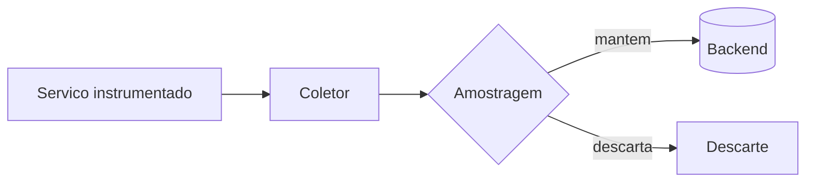

# Template Pedagógico EITA-V2 — Estrutura Obrigatória de 7 Seções por Capítulo

**Este template é CONTRATUAL.** Todo capítulo de toda obra produzida pela Fábrica
Agêntica de Livros DEVE seguir esta estrutura exata de 7 seções, nesta ordem,
com os cabeçalhos literais abaixo. Nenhuma seção pode ser omitida.

---

## Seções obrigatórias do capítulo

### 1. INTRODUÇÃO
**Objetivo:** Contextualizar o leitor no tema do capítulo. Explicar o que será
abordado, por que é relevante, e o que o leitor será capaz de fazer ao final.

**Regras:**
- Tom acessível para iniciantes, sem jargão desnecessário.
- Deve conter uma "ponte" com o capítulo anterior (se houver).
- Máximo de 2 parágrafos.
- Única seção que pode usar "você vai aprender" ou equivalente.

**Regra do callback nomeado (continuidade narrativa):**
- A "ponte" não pode ser uma transição genérica ("no capítulo anterior, vimos
  conceitos importantes..."). Nomeie explicitamente o capítulo de origem e o
  conceito retomado (fonte: `callback_capitulo_anterior` do draft do
  `estrategista`), ex.: "No Capítulo 3, você dominou a Janela de Contexto —
  agora vamos aplicar essa mesma lente à memória distribuída."
- Capítulo 1 não tem capítulo anterior: pule esta regra.

### 2. EXPLICA
**Objetivo:** Desconstrução teórica fundamental do conceito: causa raiz, mecânica
subjacente, definições precisas.

**Regras:**
- Posicione o leitor como agente ativo: "você vai perceber que...", "note como...".
- Inclua definições formais quando aplicável.
- Profundidade suficiente para que um PhD no assunto encontre valor, mas linguagem
  acessível para um iniciante.
- Citações obrigatórias `[N]` para afirmações factuais.

**Regras de densidade de citação (evitar tom de revisão de literatura):**
- A citação **reforça**, nunca **substitui**, a explicação: toda `[N]` vem depois de
  uma frase que já expressa a ideia em linguagem própria do redator.
- Nunca empilhe 2+ citações consecutivas (`[N][N]` ou `[N] [N]`) sem uma frase de
  transição entre elas — cada citação separada por prosa real.
- No máximo 2 citações por parágrafo nesta seção. Se houver mais dados/estatísticas
  a citar, mova o excedente para uma tabela ou para a seção Técnica.
- Prefira citação narrativa ("Estudos mostram que [N]...") a citação solta no fim de
  uma lista de números — o efeito buscado é o de um mentor contando uma ideia
  embasada, não um parágrafo de estatísticas creditadas.

**Transformação implícita:** o leitor passa de "não sei o que é" para "sei definir
e explicar".

### 3. ILUSTRA
**Objetivo:** Analogia física, metáfora industrial ou exemplo concreto que ancore
o conceito na intuição do leitor — sempre acompanhado de **um diagrama visual**.

**Regra do motivo condutor (unidade narrativa da obra):**
- A obra inteira tem **um único** motivo condutor, definido pelo `arquiteto` em
  `sumario_macro.json.motivo_condutor` (nome, descrição, vocabulário). Todo
  capítulo **reutiliza** esse mesmo cenário/persona na seção Ilustra — nunca
  invente uma metáfora nova e isolada por capítulo que não recorra em nenhum
  outro lugar da obra.
- Prefira reaproveitar o vocabulário do motivo condutor também nas transições de
  Explica/Técnica/Aplica/Conclusão (não só na Ilustra), para que o leitor nunca
  perca o fio condutor entre capítulos.
- Exceção: `tipo_obra = "tcc"` não usa motivo condutor (tom acadêmico impessoal).

**Regra da persona do leitor (identidade recorrente):**
- Além do cenário do motivo condutor, a obra tem uma `persona_leitor` nomeada
  (ex.: "Engenheiro Agêntico") em `sumario_macro.json.motivo_condutor`. Reforce
  essa identidade em 2ª pessoa com moderação (ex.: "Como Engenheiro Agêntico,
  você já percebe que...") — no máximo 1-2 vezes por capítulo, nunca em toda
  página, para não soar repetitivo.

**Regra da dupla camada (conceito denso):**
- Se o pilar veio marcado `"conceito_denso": true` pelo `estrategista`, escreva
  **duas** analogias complementares: uma para a mecânica geral do conceito, outra
  focada especificamente no ponto mais difícil/contraintuitivo. Isso é reforço
  pedagógico redundante deliberado — não redundância acidental.
- Pilares sem essa marcação levam apenas 1 analogia (a regra abaixo).

**Regras:**
- Deve ser concreta e verificável, não decorativa.
- A analogia deve ser tão clara que o leitor pense "agora entendi".
- Use exemplos do cotidiano do desenvolvedor (mercado, código, equipes).
- Se a analogia for de outra área (física, biologia, etc.), explique a conexão.
- **OBRIGATÓRIO (R11): no mínimo 1 bloco ```mermaid válido** nesta seção,
  representando o conceito do capítulo (fluxo, arquitetura, sequência, estado ou
  hierarquia). Diagrama em ASCII art **não** satisfaz o requisito.

**Regras do diagrama Mermaid:**
- Tipos aceitos: `flowchart`, `sequenceDiagram`, `stateDiagram-v2`, `classDiagram`,
  `erDiagram`, `mindmap`, `gantt`, `journey`.
- Primeira linha do bloco deve declarar a legenda:
  `%% legenda: <descrição objetiva do diagrama>`
  (o pipeline usa essa linha como legenda da figura no PDF; não escreva "Figura N"
  na legenda — a numeração é automática).
- Rótulos em PT-BR, sem acento em identificadores de nó (só no texto entre colchetes).
- Máximo de 12 nós: diagrama denso demais não ensina.
- O diagrama é renderizado em PNG pelo pipeline
  (`scripts/renderizar-diagramas.py`); se a sintaxe estiver inválida, ele aparece
  como bloco de código no PDF e a auditoria reprova o capítulo.

```markdown

```

**Transformação implícita:** o leitor passa de "parece abstrato" para "faz total
sentido".

### 4. TÉCNICA
**Objetivo:** Entrega prática de alto valor: código, arquitetura, esquema de dados,
diagrama, passo a passo de implementação. É o núcleo de valor do capítulo.

**Regra dos sub-títulos evocativos (seções longas):** como esta seção é no
mínimo 60% do capítulo, textos longos (mais de ~800 palavras na seção) DEVEM
ser quebrados em blocos com sub-títulos em `###` (ex.: `### A Falha na Esteira
e a Correção Estrutural`) em vez de um bloco único de prosa corrida. Use
`###` (nunca `##`) — o pipeline detecta seções pelo padrão `## N. Nome`, então
`###` nunca interfere na divisão das 7 seções nem na auditoria. Os sub-títulos
podem (e devem) usar o vocabulário do motivo condutor da obra, e ajudam a
variar o ritmo de leitura em blocos técnicos densos. A seção "Aplica" pode
usar o mesmo recurso quando for longa.

**Regras:**
- Código real, executável (não pseudocódigo, a menos que justificado).
- Arquiteturas e esquemas de dados reais.
- Passos numerados ou sequenciais.
- Mínimo de 60% do conteúdo do capítulo deve estar nesta seção.
- Citações `[N]` obrigatórias para técnicas, benchmarks e estatísticas.
- **OBRIGATÓRIO (R12): no mínimo 1 bloco de código** nesta seção.
- **Todo bloco de código DEVE declarar a linguagem** na cerca
  (```python, ```javascript, ```typescript, ```bash, ```json, ```yaml, ```sql...).
  Bloco sem linguagem não é validável e reprova na auditoria.
- **CI de código (R12):** o código passa por validação de sintaxe automática
  (`python scripts/validar-codigo.py <slug> --capitulo <n>`). Escreva código que
  compila de verdade — sem `...` no meio da lógica, sem chaves desbalanceadas,
  sem imports fantasma. Trechos deliberadamente parciais devem ser fechados como
  função/classe completa, com corpo mínimo válido (`pass`, `return null`).
- Placeholders de credencial são permitidos como string literal
  (`API_KEY = "<seu-token>"`), nunca como sintaxe solta.

**Transformação implícita:** o leitor passa de "não sei fazer" para "consigo
implementar".

### 5. APLICA
**Objetivo:** Contextualização em cenário corporativo real, de alta performance ou
produção industrial. Conecta a técnica ao resultado de negócio.

**Regra da cena de contraste (obrigatória — Erro Comum vs. Prática Correta):**
Antes de listar armadilhas, narre **uma cena única, em 2ª pessoa**, no formato:
1. Situação concreta (o leitor está fazendo uma tarefa específica).
2. O erro plausível que ele cometeria seguindo o instinto errado — mostre o erro
   acontecendo, não apenas descrito em abstrato.
3. O diagnóstico (por que aquilo deu errado, ligando à teoria da seção Explica).
4. A correção (o que fazer diferente, na prática).
A lista de "armadilhas comuns" pode continuar existindo depois da cena, como
síntese rápida — mas nunca **substituindo** a cena narrativa. É essa dramatização
erro→correção que gera o efeito "agora entendi na pele", não a enumeração.

**Regras:**
- Cenário realista (startup, scale-up, enterprise).
- Métricas de sucesso e fracasso.
- Armadilhas comuns e como evitá-las (depois da cena de contraste, como síntese).
- O leitor deve se enxergar aplicando aquilo no trabalho dele.

**Transformação implícita:** o leitor passa de "isso é teórico" para "vou usar no
mercado".

### 6. CONCLUSÃO
**Objetivo:** Síntese do que foi aprendido, conexão com o próximo capítulo (se
houver) e desafio final para o leitor.

**Regras:**
- Recapitule os 3 pontos principais em 1 parágrafo.
- Desafio ou exercício opcional.
- Ponte para o próximo capítulo (se houver).
- Tom de encerramento que reforça a transformação do leitor.

### 7. REFERÊNCIAS BIBLIOGRÁFICAS
**Objetivo:** Listar todas as fontes citadas no capítulo no formato ABNT numerado.

**Regras:**
- Use o formato ABNT: `[N] SOBRENOME, Nome. *Título*. Disponível em: URL. Acesso em: DD mês. AAAA.`
- Apenas fontes EFETIVAMENTE citadas no capítulo (com `[N]` no texto).
- Não incluir fontes do dossiê que não foram citadas neste capítulo.
- Mínimo de 3 referências por capítulo.
- Ordem alfabética por título.

---

## Estrutura visual no Markdown

```markdown
# Capítulo <N>: <Título>

## 1. Introdução
...

## 2. Explica
...

## 3. Ilustra
(Analogia + 1 diagrama ```mermaid obrigatório com `%% legenda:`)

## 4. Técnica
(Código com linguagem declarada, validado por CI de sintaxe)

## 5. Aplica
...

## 6. Conclusão
...

## 7. Referências Bibliográficas
[1] ...
[2] ...
```
