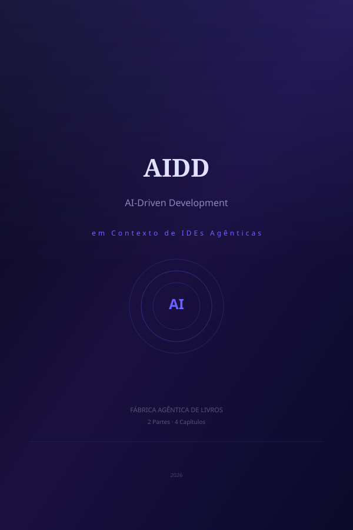

# Prefácio

Situar o leitor no momento histórico da engenharia de software, onde a IA transita de ferramenta passiva de autocomplete para agente ativo e executor no ciclo de vida de desenvolvimento, e apresentar AIDD como o paradigma emergente que redefine o papel do desenvolvedor.

A obra está organizada em 2 Partes, totalizando
4 Capítulos.

# Sumário

- **Parte I — Fundamentos do Desenvolvimento Orientado por IA**
  - Capítulo 1: O Paradigma AIDD: Especificação, Autonomia e Ciclos de Auto-Correção
  - Capítulo 2: Ecossistema de IDEs Agênticas: Claude Code, Cursor, Windsurf e o MCP
- **Parte II — Fluxos, Ferramentas e Práticas de AIDD**
  - Capítulo 3: Spec-to-Code e Sub-Agentes Paralelos: Orquestração de Pipelines de Desenvolvimento
  - Capítulo 4: Desafios, Limitações e o Futuro do Desenvolvimento com Agentes

---

# Parte I — Fundamentos do Desenvolvimento Orientado por IA

# Capítulo 1 — O Paradigma AIDD: Especificação, Autonomia e Ciclos de Auto-Correção

A engenharia de software atravessa uma transformação silenciosa mas radical. Durante décadas, o ato de programar foi sinônimo de traduzir pensamentos em sintaxe — linha por linha, arquivo por arquivo. As ferramentas de IA, primeiro com autocomplete, depois com chat contextual, automatizaram partes desse processo, mas sempre como coadjuvantes. O AI-Driven Development (AIDD) representa a primeira ruptura verdadeira: a IA deixa de ser ferramenta passiva e torna-se agente ativo no ciclo de vida do desenvolvimento.

## Specification-Driven Development: Especificações Como Executáveis

No cerne do AIDD está o Specification-Driven Development (SDD). Em vez de escrever centenas de linhas de código implementando uma funcionalidade, o desenvolvedor escreve uma especificação em linguagem natural — geralmente em Markdown, estruturada em arquivos como `SPEC.md` ou `CLAUDE.md` — que descreve o que precisa ser construído, em que contexto, e com quais restrições.

O agente de IA então interpreta essa especificação como um conjunto de instruções executáveis. Ele planeja a implementação, divide em tarefas, escreve o código, executa testes e valida o resultado contra os critérios definidos na especificação. O desenvolvedor não precisa mais se preocupar com a sintaxe exata de cada biblioteca ou framework — ele define o *o quê* e o *por quê*, e o agente descobre o *como*.

Um exemplo prático: em vez de escrever uma função de autenticação OAuth2 manualmente, o desenvolvedor escreve uma especificação Markdown descrevendo o fluxo desejado, provedores suportados, requisitos de segurança e tratamento de erros. O agente então implementa a solução completa, incluindo rotas, middleware, validação e testes.

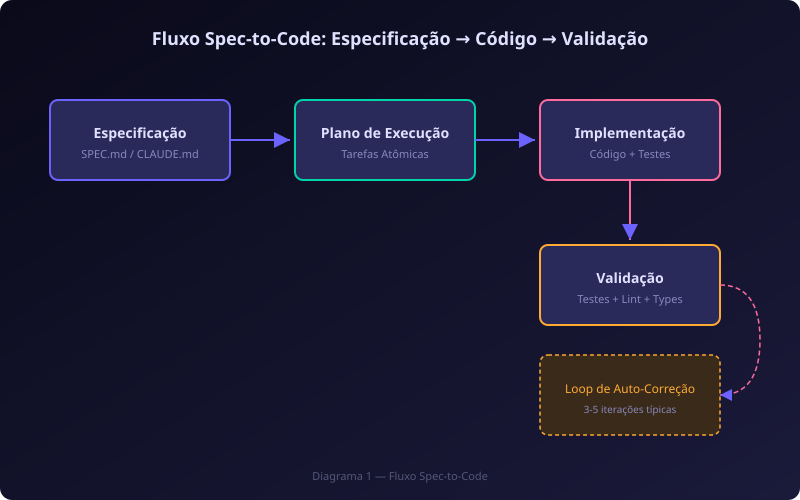

## Ciclos de Auto-Correção: Build, Erro, Análise, Patch, Re-Teste

O que diferencia verdadeiramente o AIDD de ferramentas de autocomplete tradicionais é a capacidade de ciclos de auto-correção autônomos. O agente não apenas escreve código — ele o executa, observa o resultado, diagnostica falhas e as corrige sem intervenção humana.

O ciclo funciona em cinco estágios:

1. **Build**: O agente executa o comando de compilação ou teste (`npm test`, `pytest`, `cargo check`)
2. **Erro**: O terminal retorna um erro — stack trace, falha de tipo, teste vermelho
3. **Análise**: O agente captura a saída de erro, rastreia a causa raiz no código-fonte e identifica o arquivo e linha problemáticos
4. **Patch**: O agente aplica a correção necessária — ajusta tipos, reescreve a lógica, atualiza imports
5. **Re-Teste**: O agente reexecuta o comando de validação e verifica se o erro foi resolvido

Esse ciclo se repete autonomamente até que o critério de sucesso seja atingido ou que o agente identifique um bloqueio que requer intervenção humana (como uma ambiguidade na especificação). Em testes reais com Claude Code e Cursor, ciclos de 3 a 5 iterações resolvem a maioria dos erros de compilação e teste.

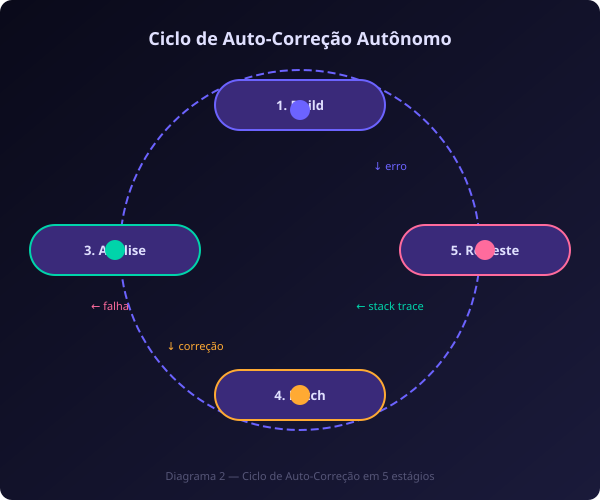

## O Desenvolvedor como Arquiteto e Orquestrador de Agentes

A transição mais profunda que o AIDD impõe é no papel do desenvolvedor. Tradicionalmente, um desenvolvedor júnior escrevia código simples, um pleno escrevia código complexo, e um sênior definia arquitetura enquanto ainda escrevia código crítico. No AIDD, todos os desenvolvedores — independentemente de senioridade — operam em um nível mais abstrato.

O desenvolvedor torna-se um **arquiteto de sistemas** que especifica a estrutura geral, um **engenheiro de prompts** que sabe comunicar intenções claras a agentes, e um **auditor** que valida o código gerado por múltiplos agentes paralelos. As habilidades mais valiosas deixam de ser conhecimento de sintaxe ou memorização de APIs e passam a ser:

- **Clareza de especificação**: a capacidade de escrever requisitos inequívocos
- **Pensamento sistêmico**: entender como partes do sistema interagem em nível arquitetural
- **Curadoria de código**: avaliar rapidamente código gerado por IA por correção, segurança e aderência a padrões
- **Orquestração**: coordenar múltiplos agentes trabalhando em paralelo em diferentes partes do sistema

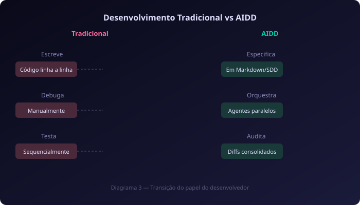

# Capítulo 2 — Ecossistema de IDEs Agênticas: Claude Code, Cursor, Windsurf e o MCP

O ecossistema de desenvolvimento agêntico amadureceu rapidamente desde 2024. O que começou como experimentos isolados em CLIs e extensões de editor convergiu para um conjunto de plataformas maduras, cada uma com filosofia própria de interação agente-humano. Compreender esse ecossistema é essencial para escolher a ferramenta certa para cada contexto.

## Claude Code, Cursor, Windsurf: Arquiteturas e Diferenciais

Três plataformas dominam o cenário atual de IDEs agênticas, cada uma com abordagem distinta:

**Claude Code** (Anthropic) é uma CLI agêntica que opera diretamente no terminal, sem interface gráfica. Sua força está na integração profunda com o ecossistema UNIX — pipes, redirecionamento, hooks git e servidores MCP. Ele indexa o repositório inteiro, executa comandos de shell, gerencia branches e permite a criação de sub-agentes que processam tarefas em paralelo. É a escolha ideal para automação em CI/CD, refatorações em escala e integração com ferramentas de linha de comando.

**Cursor** (Anysphere) é uma IDE baseada em fork do VS Code que integra IA diretamente no editor visual. Seu modo *Agent* permite que o modelo planeje e execute tarefas multi-arquivo enquanto o desenvolvedor acompanha em tempo real. O *Composer* coordena edições em múltiplos arquivos simultaneamente. Cursor se destaca pela versatilidade de modelos — suporta Claude, GPT e Gemini intercambiavelmente por tarefa — e pela manutenção da compatibilidade total com extensões do ecossistema VS Code.

**Windsurf** (Codeium) é outra IDE fork do VS Code com foco em contexto contínuo. Seu *Cascade* é um planejador multi-etapas que mantém estado entre sessões (*Flow*), evitando que o agente "esqueça" o contexto ao alternar entre tarefas. Windsurf brilha em monorepos complexos e arquiteturas multi-módulo, onde a capacidade de reter contexto entre execuções é crítica.

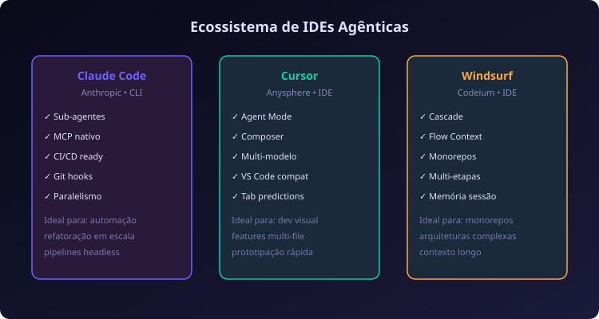

## Model Context Protocol: O 'USB-C para IA' e seus Servidores

Introduzido pela Anthropic em novembro de 2024, o Model Context Protocol (MCP) resolve um dos gargalos mais persistentes da integração de IA com ferramentas externas: a fragmentação de conectores proprietários.

Antes do MCP, cada IDE precisava implementar conectores específicos para cada fonte de dados — um para bancos SQL, outro para APIs REST, outro para sistemas de arquivos. Cada conector era frágil, específico de plataforma e difícil de manter.

O MCP padroniza essa comunicação em um modelo cliente-servidor: o *MCP Client* (a IDE ou CLI agêntica) se conecta a *MCP Servers* (processos que expõem ferramentas, recursos e prompts). Qualquer desenvolvedor pode criar um servidor MCP para expor qualquer sistema — banco de dados, API, sistema de arquivos, navegador — e imediatamente torná-lo acessível a todas as IDEs compatíveis.

Os modos de transporte incluem stdio (para servidores locais, processos filho) e Streamable HTTP (para servidores remotos). O protocolo define três tipos de primitivas: **Tools** (operações que o agente pode invocar), **Resources** (dados que o agente pode ler) e **Prompts** (templates que o agente pode usar). Essa separação permite controle granular de permissões e segurança.

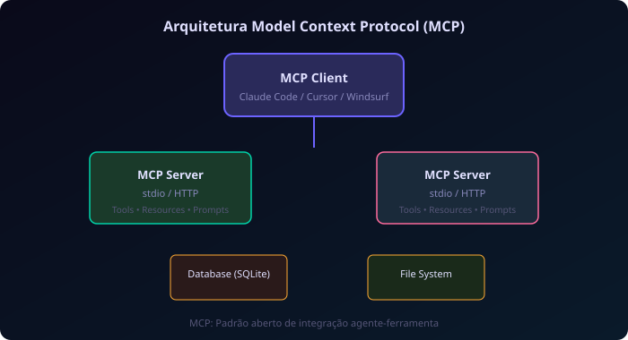

## Extensões Open-Source: Cline, Roo Code e o Ecossistema BYOK

Paralelamente às plataformas comerciais, um ecossistema open-source robusto floresceu. **Cline** (originalmente Claude Dev) é uma extensão para VS Code que transforma o editor padrão em um ambiente agêntico completo — leitura e escrita de arquivos, execução de terminal, navegação web e gerenciamento de arquivos — tudo com aprovação granular do usuário.

**Roo Code** segue filosofia similar, com ênfase em modos de operação (architect, code, debug) e suporte a múltiplos provedores de modelo via Bring Your Own Key (BYOK). Isso permite que times usem a mesma interface com modelos locais (via Ollama), provedores corporativos ou APIs públicas.

O ecossistema BYOK é particularmente relevante para organizações com restrições de dados: elas podem usar a mesma experiência agêntica com modelos hospedados internamente, mantendo compliance sem abrir mão da produtividade.

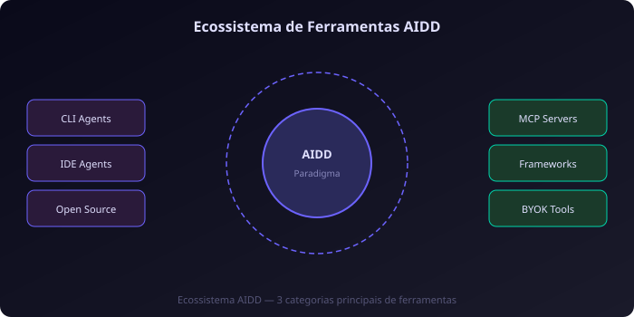

# Parte II — Fluxos, Ferramentas e Práticas de AIDD

# Capítulo 3 — Spec-to-Code e Sub-Agentes Paralelos: Orquestração de Pipelines

O verdadeiro potencial do AIDD não está em gerar código isolado, mas em orquestrar pipelines inteiros de desenvolvimento onde múltiplos agentes colaboram paralelamente sob coordenação humana. Este capítulo explora os padrões de orquestração que transformaram a engenharia de software.

## Spec-to-Code: da Especificação Markdown ao Código Executável

O padrão Spec-to-Code é o fluxo fundamental do AIDD. Um desenvolvedor escreve uma especificação em Markdown — geralmente em um diretório `/specs` do repositório — e um agente a transforma em implementação completa. O fluxo típico tem quatro estágios:

1. **Parsing da Especificação**: O agente lê o arquivo Markdown e extrai requisitos, regras de negócio, critérios de aceitação e restrições técnicas. Arquivos de contexto como `CLAUDE.md` ou `.cursorrules` fornecem o contexto adicional do projeto — convenções, stack tecnológica, padrões arquiteturais.

2. **Geração do Plano**: O agente decompõe a especificação em tarefas atômicas ordenadas. Cada tarefa tem pré-condições, arquivos afetados, implementação esperada e critérios de validação. Este plano é apresentado ao desenvolvedor como um diff preview antes da execução.

3. **Execução Orquestrada**: O agente implementa cada tarefa na ordem definida, executando comandos de terminal, editando arquivos e rodando validações intermediárias. Erros são tratados pelo ciclo de auto-correção descrito no Capítulo 1.

4. **Validação Final**: O agente executa a suíte completa de testes, verifica lint e formatação, e apresenta o diff consolidado para revisão humana. O desenvolvedor pode aprovar, solicitar ajustes ou rejeitar o resultado.

Este padrão é particularmente eficaz para tarefas bem especificadas: adicionar uma rota de API, implementar um componente de UI com comportamento definido, ou refatorar um módulo com contrato conhecido.

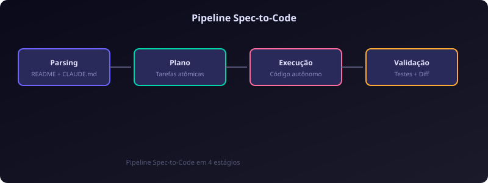

## Delegação Paralela: Sub-Agentes para Schema, Testes e Documentação

Um dos diferenciais mais poderosos do AIDD é a capacidade de delegar tarefas simultâneas a sub-agentes especializados. Enquanto um agente principal coordena o fluxo geral, sub-agentes processam partes independentes em paralelo.

Considere uma tarefa de adicionar uma nova entidade ao sistema. O agente orquestrador pode delegar simultaneamente:

- **Sub-agente de banco de dados**: Gera a migração SQL, atualiza o schema do ORM e cria índices
- **Sub-agente de API**: Implementa os endpoints REST/GraphQL com validação e tratamento de erros
- **Sub-agente de testes**: Escreve testes unitários e de integração para a nova entidade
- **Sub-agente de documentação**: Atualiza a documentação da API e gera exemplos de uso

Cada sub-agente opera em contexto isolado, com acesso apenas aos arquivos relevantes para sua tarefa. O orquestrador coleta os resultados, resolve conflitos de merge, executa a validação integrada e apresenta o resultado consolidado.

Esta arquitetura reduz o tempo de implementação de horas para minutos em tarefas que envolvem múltiplas camadas do sistema, e é suportada nativamente por ferramentas como Claude Code (via sub-agents) e Antigravity (via agent graph).

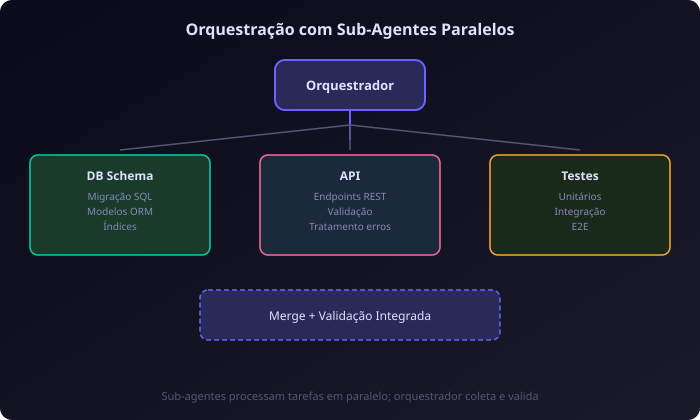

## Validação em Loop Fechado e Revisão Humana de Diff

O último estágio de qualquer pipeline AIDD é a validação integrada combinada com revisão humana. Após a execução autônoma, o agente:

1. Executa a suíte completa de testes (unitários, integração, e2e)
2. Verifica lint, formatação e tipos
3. Gera um diff consolidado de todas as alterações
4. Apresenta o diff para revisão humana com anotações sobre cada alteração

A revisão humana é o gate final — o desenvolvedor auditor inspeciona o diff em busca de problemas que agentes autônomos tipicamente ignoram: violações de convenções não documentadas, decisões arquiteturais que não se alinham com a visão de longo prazo do produto, e vulnerabilidades de segurança sutis.

Este modelo de "agente escreve, humano revisa" é dramaticamente mais produtivo que o ciclo tradicional "humano escreve, humano revisa, humano corrige". Estudos informais de times usando AIDD reportam reduções de 40-60% no tempo de implementação de funcionalidades, mantendo ou melhorando a qualidade do código graças à revisão humana focada.

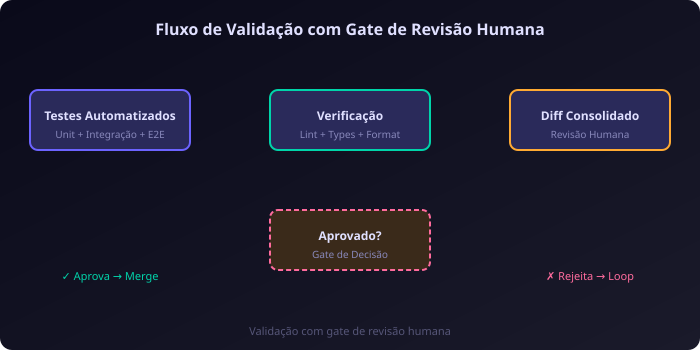

# Capítulo 4 — Desafios, Limitações e o Futuro do Desenvolvimento com Agentes

Nenhuma tecnologia emerge sem desafios. O AIDD, apesar de seu potencial transformador, enfrenta limitações significativas que precisam ser compreendidas e mitigadas para adoção responsável em ambientes de produção.

## Alucinação de Contexto e Deriva Arquitetural em Codebases Grandes

O problema mais comum em execuções longas de agentes é a **alucinação de contexto**. Diferente da alucinação de fatos em chatbots, aqui o agente "esquece" ou "distorce" o contexto do projeto ao longo de múltiplas iterações, introduzindo código que viola padrões não escritos da equipe.

Em codebases acima de 100 mil linhas, com múltiplos módulos e convenções históricas, agentes tendem a:

- **Ignorar padrões existentes**: Usar uma biblioteca diferente da que o resto do time usa para resolver o mesmo problema
- **Duplicar funcionalidades**: Criar novas funções que já existem em módulos que o agente não examinou
- **Violar convenções de naming**: Misturar camelCase com snake_case, ou usar padrões de diretório diferentes do estabelecido
- **Propagar erros**: Repetir o mesmo padrão incorreto em múltiplos arquivos porque o agente "aprendeu" o padrão errado do contexto

A mitigação mais eficaz é a manutenção rigorosa de arquivos de contexto como `CLAUDE.md`, `.cursorrules` e especificações em `SPEC.md` — quanto mais explícitas as convenções, menor a probabilidade de deriva.

## Segurança: Permissões de Terminal, Sandboxing e Confused Deputy

Agentes com capacidade de execução de comandos de terminal representam um vetor de risco significativo. O cenário mais preocupante é o ataque **Confused Deputy**: um prompt malicioso engana o agente para executar comandos destrutivos, usando a confiança que o desenvolvedor depositou no agente.

As principais camadas de segurança incluem:

- **Listas de permissão de comandos**: Restringir quais comandos o agente pode executar (ex: permitir `npm test` mas bloquear `rm -rf`)
- **Sandboxing por container**: Executar agentes em containers Docker com volumes montados apenas para leitura em diretórios críticos
- **Aprovação granular**: Exigir confirmação humana para comandos que alteram o sistema de arquivos fora do diretório do projeto
- **Detecção de padrões suspeitos**: Alertar sobre comandos que combinam operações de leitura com chamadas de rede externa

Ferramentas como Claude Code implementam um modelo de permissões onde o desenvolvedor pode configurar níveis de autonomia — desde "aprovar tudo" até "bloquear comandos de rede e instalação de pacotes".

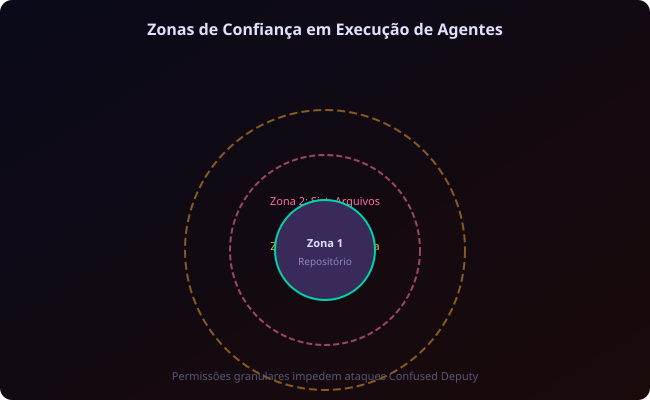

## Futuro: Agentes Especialistas, MCP como Padrão Industrial

O AIDD está em seus estágios iniciais. As tendências que definem sua evolução incluem:

**Agentes Especialistas por Domínio**: Em vez de um agente genérico que tenta fazer tudo, veremos ecossistemas de agentes especializados — um para segurança, outro para banco de dados, outro para frontend — cada um com profundo conhecimento de seu domínio e capaz de colaborar com os demais via protocolos padronizados.

**MCP como Padrão Industrial**: O Model Context Protocol tem potencial para se tornar o padrão universal de integração agente-ferramenta, assim como HTTP/HTML se tornaram o padrão da web. Seu modelo aberto, a adoção por múltiplas plataformas e a facilidade de criação de servidores MCP criam um círculo virtuoso de expansão do ecossistema.

**Evolução do Papel do Desenvolvedor**: O desenvolvedor do futuro será cada vez mais um **especificador-orquestrador**: alguém que entende profundamente o domínio do problema, sabe traduzir necessidades de negócio em especificações precisas, e coordena times de agentes para executar a implementação. Habilidades de comunicação, pensamento sistêmico e curadoria serão mais valorizadas que conhecimento de sintaxe.

O AIDD não elimina a necessidade de desenvolvedores experientes — pelo contrário, amplifica seu impacto. Um desenvolvedor que entende arquitetura, segurança e domínio do negócio pode, com agentes, produzir o trabalho de um time inteiro. O desafio não é tecnológico, mas cultural: abraçar um novo paradigma onde o código é apenas o resultado final, não o processo.

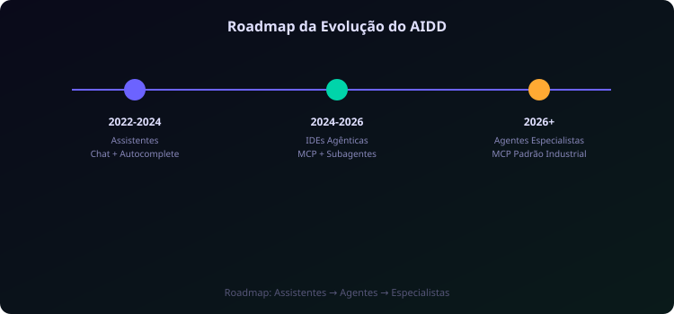

---

# Conclusão

Consolidar AIDD como a nova disciplina de engenharia de software do século XXI, onde o valor do desenvolvedor reside na capacidade de especificar, orquestrar e auditar sistemas multi-agente — e não mais na escrita manual de cada linha de código.

---

# Referências Bibliográficas

*Nenhuma referência bibliográfica foi coletada durante a pesquisa.*

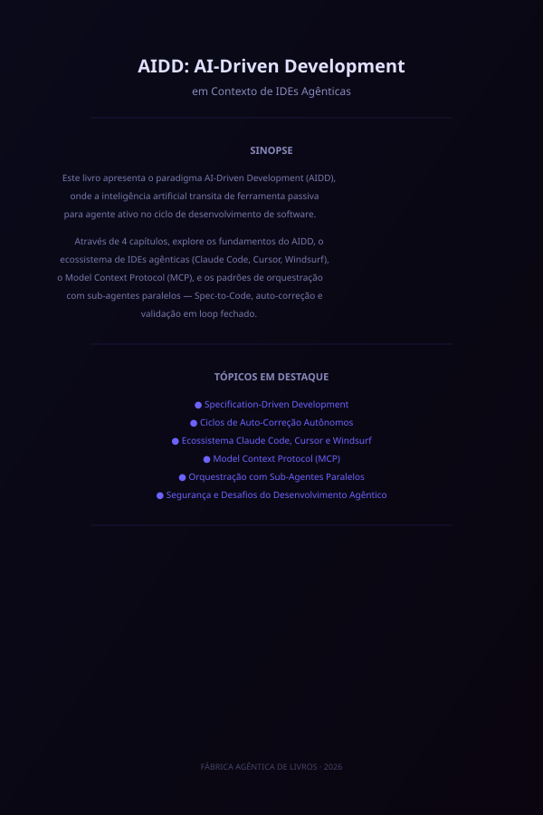

<!--
  Produzido pela Fábrica Agêntica de Livros
  Skill: compilador-abnt (Nós 5-10)
  Slug: aidd-ai-driven-development-em-contexto-de-ides-agenticas
  Capítulos: 4
  Gerado em: 2026-07-28
-->
