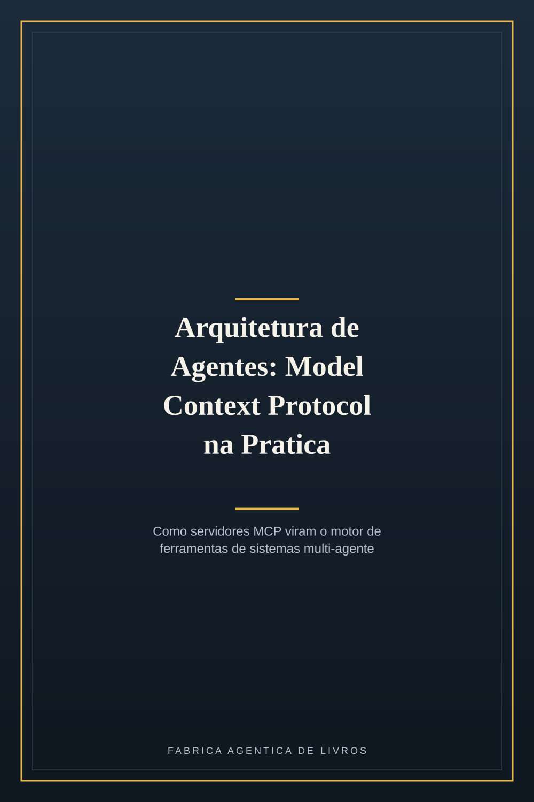
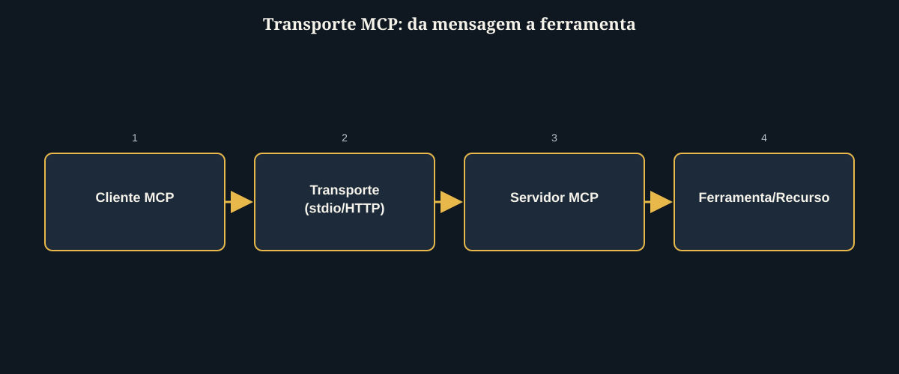
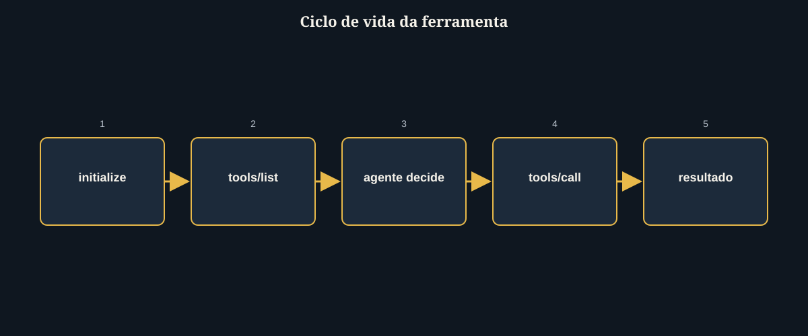
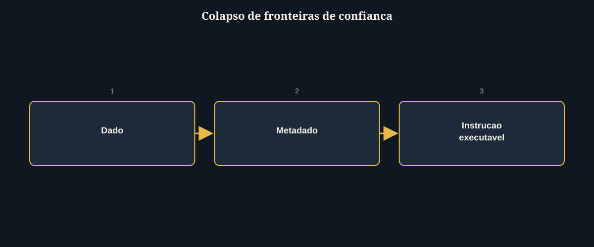
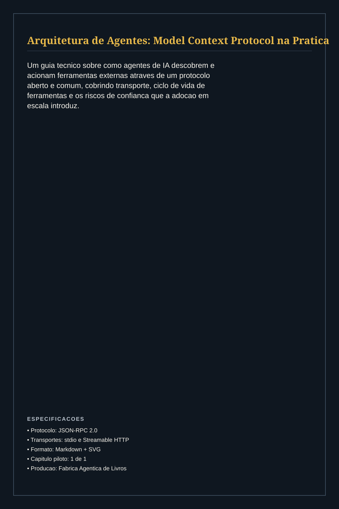

# Arquitetura de Agentes: Model Context Protocol na Prática

# Prefácio

Este livro nasce de um gargalo concreto na engenharia de sistemas de IA: a
fragmentação das integrações entre agentes e as ferramentas que eles precisam acionar.
Cada conector proprietário reescrito para cada novo par agente-ferramenta impõe um
custo de manutenção que cresce mais rápido do que a capacidade de qualquer equipe de
absorvê-lo, e é precisamente esse gargalo que motivou a criação de um protocolo aberto
e comum de integração — o Model Context Protocol (MCP). Nesta obra, a proposta é
percorrer, com profundidade técnica e exemplos executáveis, a arquitetura que faz do
MCP o motor padronizado de ferramentas de um agente: como as mensagens trafegam, como
um agente descobre e invoca capacidades em tempo de execução, e onde essa mesma
flexibilidade abre superfícies de risco que qualquer arquitetura de produção precisa
enderaçar deliberadamente.

## Sumário

**Parte I — Fundamentos de Integração Agente-Ferramenta**
- Capítulo 1 — Arquitetura de Servidores MCP como Motor de Ferramentas para Agentes de IA

---

# Parte I — Fundamentos de Integração Agente-Ferramenta

# Capítulo 1 — Arquitetura de Servidores MCP como Motor de Ferramentas para Agentes de IA

Um agente de IA só é tão útil quanto as ferramentas que consegue acionar. Durante anos,
cada integração entre um modelo de linguagem e um sistema externo — um banco de dados,
uma API de busca, um gerador de imagem — exigia um conector proprietário, reescrito a
cada novo agente e a cada nova ferramenta. O Model Context Protocol (MCP), introduzido
pela Anthropic em novembro de 2024 e hoje sob governança da Agentic AI Foundation dentro
da Linux Foundation, resolve esse problema definindo um vocabulário comum: um agente
que fala MCP pode acionar qualquer ferramenta que também fale MCP, sem conector
dedicado. Este capítulo dissseca a arquitetura desse protocolo a partir de três pilares:
o transporte que carrega as mensagens, o ciclo de vida que rege a descoberta e a
invocação de ferramentas, e os riscos de confiança que a própria flexibilidade do
protocolo introduz.

## Protocolo e Transporte: JSON-RPC 2.0 sobre stdio e Streamable HTTP

Na raiz do MCP não há nenhuma inovação exótica: é JSON-RPC 2.0 trafegando sobre um de
dois transportes padronizados. Cada mensagem trocada entre cliente e servidor é um
objeto JSON com `method`, `params` e um `id` de correlação — o mesmo formato usado por
sistemas RPC desde os anos 2000. A escolha deliberada por um padrão maduro, em vez de um
formato proprietário, é o que permite que qualquer SDK, em qualquer linguagem, implemente
um cliente ou servidor MCP em poucas horas.

Pense no transporte como a esteira física de uma fábrica: não importa o que está sendo
transportado — uma peça bruta ou um produto acabado —, a esteira em si é sempre a mesma
correia, com a mesma largura e velocidade. O MCP define duas "esteiras" possíveis. A
primeira é o **stdio**: o cliente inicia o servidor como um subprocesso local e troca
mensagens diretamente pela entrada e saída padrão do processo. Não há round-trip de
rede, não há socket TCP para configurar — é a opção de menor latência e menor superfície
de ataque, ideal para ferramentas que rodam na mesma máquina do agente. A segunda é o
**Streamable HTTP**: um único endpoint que aceita requisições `POST` (para enviar
mensagens ao servidor) e `GET` (para abrir um fluxo de eventos via Server-Sent Events,
permitindo que o servidor envie mensagens assíncronas de volta ao cliente). Esse
transporte é o que viabiliza servidores MCP remotos, multi-tenant, hospedados como
serviço.



Na prática, a implementação de um servidor stdio se resume a inicializar um transporte
e conectá-lo a uma instância do servidor:

```javascript
import { McpServer } from "@modelcontextprotocol/sdk/server/mcp.js";
import { StdioServerTransport } from "@modelcontextprotocol/sdk/server/stdio.js";

const server = new McpServer({ name: "minha-ferramenta", version: "1.0.0" });
// ... registro de tools via server.tool(...)

const transport = new StdioServerTransport();
await server.connect(transport);
```

Note que o código acima não menciona nenhum detalhe de rede, autenticação ou formato de
mensagem — tudo isso é responsabilidade do SDK e do transporte escolhido. Essa é
precisamente a promessa de valor do protocolo: o autor de uma ferramenta escreve apenas
a lógica de negócio da ferramenta, e o SDK cuida do resto. Em arquiteturas de produção,
a escolha entre stdio e Streamable HTTP não é estética — é uma decisão de topologia:
ferramentas que exigem acesso a recursos locais (sistema de arquivos, banco de dados
embarcado) quase sempre usam stdio; ferramentas compartilhadas por múltiplos agentes ou
expostas como serviço de plataforma quase sempre usam Streamable HTTP.

## Ciclo de Vida da Ferramenta: Descoberta e Invocação

Um servidor MCP não expõe uma API fixa e documentada externamente como uma API REST
tradicional — ele se auto-descreve em tempo de execução. O ciclo de vida de uma sessão
MCP segue três etapas obrigatórias: `initialize` (o cliente e o servidor negociam
capacidades e versão do protocolo), `tools/list` (o cliente pergunta "quais ferramentas
você expõe?" e recebe de volta uma lista com nome, descrição e schema de entrada de
cada uma) e `tools/call` (o cliente invoca uma ferramenta específica, passando
argumentos que respeitam o schema anunciado, e recebe um resultado estruturado).

Esse ciclo de descoberta é equivalente a um técnico chegando a uma fábrica desconhecida
e, antes de operar qualquer máquina, primeiro caminhando pelo chão de fábrica e lendo a
placa de cada equipamento — o que ele faz, quais insumos aceita, o que produz — antes de
ligar qualquer botão. O agente de IA faz exatamente isso: na inicialização da sessão,
ele descobre dinamicamente o inventário de ferramentas disponíveis, sem precisar que
essa lista tenha sido codificada previamente no seu prompt ou no seu código.



Tecnicamente, isso significa que o mesmo agente, apontado para servidores MCP diferentes,
se comporta como uma ferramenta genérica de orquestração:

```javascript
const tools = await client.listTools();
// tools.tools = [{ name: "gerar_imagem", description: "...", inputSchema: {...} }, ...]

const resultado = await client.callTool({
  name: "gerar_imagem",
  arguments: { tipo: "diagrama", titulo: "Fluxo MCP", elementos: ["initialize", "tools/list", "tools/call"] }
});
```

O papel do agente, nesse desenho, é puramente decisório: dado um objetivo e a lista de
ferramentas descobertas, ele escolhe qual `tools/call` emitir e com quais argumentos —
toda a execução de fato acontece do lado do servidor, isolada do processo de raciocínio
do modelo. Essa separação entre "decidir o quê chamar" (agente) e "executar a chamada"
(servidor MCP) é o que permite compor sistemas multi-agente onde dezenas de servidores
especializados — busca, banco de dados, geração de imagem, sistema de arquivos — são
acoplados e desacoplados livremente, sem que o agente precise saber como cada um foi
implementado internamente.

## Riscos de Confiança: Permissões Amplas, Confused Deputy e Isolamento de Contexto

A mesma flexibilidade que torna o MCP poderoso é a origem de seus riscos mais
documentados. O primeiro é o de **permissões excessivamente amplas**: é comum que um
servidor MCP solicite acesso total a um sistema (por exemplo, leitura e escrita completa
de uma caixa de e-mail) quando a ferramenta que ele expõe precisaria apenas de leitura
de um subconjunto de mensagens. Quando múltiplos servidores com escopos amplos convivem
no mesmo agente, um comprometimento parcial de qualquer um deles abre caminho para
ataques de correlação entre serviços que nunca foram desenhados para operar juntos. O
segundo risco é o **problema do "confused deputy"**: um servidor MCP que executa uma
ação com privilégios elevados do próprio servidor, em vez de com os privilégios do
usuário que originou a requisição — violando o princípio do menor privilégio e abrindo
espaço para acesso não autorizado a recursos. O terceiro, mais estrutural, é a **ausência
de isolamento entre contexto, metadados e instruções executáveis**: ao contrário de
middlewares maduros que separam claramente dado de comando, muitas implementações MCP
deixam esses três planos coexistirem no mesmo fluxo semântico, criando superfície para
injeção de prompt — onde conteúdo malicioso embutido em um resultado de ferramenta
consegue direcionar o agente a ações não intencionais.

Pense nisso como uma esteira de fábrica sem sensores de separação entre matéria-prima,
etiquetas de identificação e ordens de produção: se tudo trafega junto, sem crachá que
distinga o que é dado do que é comando, basta uma etiqueta falsificada para que a linha
de produção execute uma ordem que ninguém autorizou.



Na prática, mitigar esses riscos é uma decisão arquitetural tomada antes de escrever
qualquer linha de código do servidor: (1) um servidor MCP por responsabilidade, com o
menor escopo de permissão que a ferramenta exige — nunca um único servidor "faz-tudo"
com acesso irrestrito a um sistema inteiro; (2) tratar todo conteúdo retornado por uma
ferramenta como dado não confiável, nunca como instrução, mesmo quando o servidor é
"seu"; (3) registrar e auditar cada `tools/call` executado, para que uma cadeia de
decisão do agente seja reconstruível após o fato. Em ambientes corporativos, essa
disciplina é o que separa uma adoção de MCP que escala com segurança de uma que
multiplica, silenciosamente, a superfície de ataque da organização — um trade-off que
se torna ainda mais relevante à medida que a adoção enterprise do protocolo ultrapassa
um quarto das empresas Fortune 500 em menos de dois anos desde seu lançamento.

O capítulo seguinte parte desses três pilares — transporte, ciclo de vida e limites de
confiança — para mostrar como eles se compõem na prática ao desenhar um servidor MCP
completo, do zero, dentro de um sistema multi-agente real.

---

# Conclusão Geral

O Model Context Protocol consolida-se como a camada de integração determinística entre
agentes de IA e as ferramentas que eles operam: um vocabulário comum de transporte
(stdio, Streamable HTTP), um ciclo de vida previsível de descoberta e invocação
(`initialize`, `tools/list`, `tools/call`), e uma composição modular que permite acoplar
e desacoplar servidores especializados sem reescrever o agente a cada integração. Essa
mesma modularidade, no entanto, é indissociável de uma tensão que definirá a próxima
fase de maturidade do protocolo: a velocidade de adoção enterprise — hoje superior a um
quarto das empresas Fortune 500 em menos de dois anos — corre à frente da maturidade dos
mecanismos de segurança que isolam contexto de comando, controlam o escopo de permissão
por servidor e eliminam a classe de problemas do tipo "confused deputy". Toda decisão de
arquitetura tomada neste capítulo — um servidor por responsabilidade, escopo mínimo,
tratamento de resultado de ferramenta como dado não confiável, auditoria de cada
invocação — é, em essência, uma aposta em favor da maturidade sobre a velocidade. É essa
aposta que separa um sistema multi-agente que escala com segurança de um que apenas
escala.

# Referências Bibliográficas

ANTHROPIC. *Introducing the Model Context Protocol*. Disponível em:
https://www.anthropic.com/news/model-context-protocol. Acesso em: 28 jul. 2026.

ARXIV. *Systematization of Knowledge: Security and Safety in the Model Context Protocol
Ecosystem*. Disponível em: https://arxiv.org/pdf/2512.08290. Acesso em: 28 jul. 2026.

DIGITAL APPLIED. *MCP Adoption Statistics 2026: Model Context Protocol*. Disponível em:
https://www.digitalapplied.com/blog/mcp-adoption-statistics-2026-model-context-protocol.
Acesso em: 28 jul. 2026.

INTERNATIONAL JOURNAL OF COMPUTATIONAL AND EXPERIMENTAL SCIENCE AND ENGINEERING. *The
Model Context Protocol and Enterprise Tool Orchestration: Architectural Patterns for
Connecting AI Agents to Production Systems at Scale*. Disponível em:
https://ijcesen.com/index.php/ijcesen/article/view/5402. Acesso em: 28 jul. 2026.

MICROSOFT COMMUNITY HUB. *Plug, Play, and Prey: The security risks of the Model Context
Protocol*. Disponível em:
https://techcommunity.microsoft.com/blog/microsoftdefendercloudblog/plug-play-and-prey-the-security-risks-of-the-model-context-protocol/4410829.
Acesso em: 28 jul. 2026.

MODEL CONTEXT PROTOCOL. *Architecture overview*. Disponível em:
https://modelcontextprotocol.io/docs/learn/architecture. Acesso em: 28 jul. 2026.

MODEL CONTEXT PROTOCOL. *Specification 2026-07-28*. Disponível em:
https://modelcontextprotocol.io/specification/2026-07-28. Acesso em: 28 jul. 2026.

MODEL CONTEXT PROTOCOL BLOG. *The 2026-07-28 MCP Specification Release Candidate*.
Disponível em: https://blog.modelcontextprotocol.io/posts/2026-07-28-release-candidate/.
Acesso em: 28 jul. 2026.

PILLAR SECURITY. *The Security Risks of Model Context Protocol (MCP)*. Disponível em:
https://www.pillar.security/blog/the-security-risks-of-model-context-protocol-mcp.
Acesso em: 28 jul. 2026.

SPEAKEASY. *What are MCP transports?*. Disponível em:
https://www.speakeasy.com/mcp/core-concepts/transports. Acesso em: 28 jul. 2026.

---


